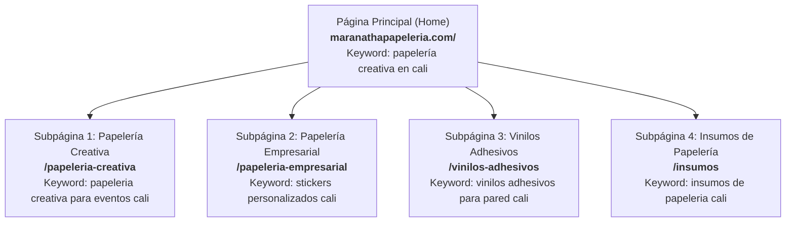

# Estrategia Maestra de Copywriting & SEO Transaccional
## Maranatha Papelería Creativa — Cali, Colombia

> **Objetivo:** Posicionar la página principal y cada una de las subpáginas en el Top 3 de Google (búsqueda orgánica y local en Cali / Colombia), convirtiendo tráfico calificado de alta intención de compra directamente a WhatsApp (+57 317 737 1301).

---

## 1. Mapa de Arquitectura Web & Clusters Temáticos

---

## 2. Página Principal (Home) — `https://maranathapapeleria.com/`

### Ficha Técnica SEO
* **Oración más buscada (Target Principal):** `Papelería creativa en Cali` (100 - 1.000 búsquedas/mes, alta intención local).
* **Keywords Transaccionales Núcleo (Validadas Google Ads Colombia):** 
  - `empaques personalizados` (100 - 1.000 búsquedas/mes | CPC hasta $2.617 COP).
  - `cajas personalizadas` (100 - 1.000 búsquedas/mes | CPC hasta $1.870 COP) y `cajas de carton personalizadas` (100 - 1.000 búsquedas/mes | +900% | CPC hasta $1.977 COP).
  - `cajas para recordatorios` (10 - 100 búsquedas/mes | CPC hasta **$5.938 COP** — *Pujas récord en eventos y celebraciones*).
  - `stickers personalizados` (100 - 1.000 búsquedas/mes | CPC hasta $1.586 COP) y `stickers troquelados` (100 - 1.000 búsquedas/mes | CPC hasta $1.916 COP).
  - `vinilos adhesivos` (1.000 - 10.000 búsquedas/mes | CPC hasta $1.295 COP).
  - `insumos de papeleria` (100 - 1.000 búsquedas/mes | CPC hasta $2.308 COP).
* **Keywords de Búsqueda Local Transaccional ("Dónde mandar a hacer"):** 
  - `donde hacen cajas de carton personalizadas` (CPC hasta $2.327 COP).
  - `donde hacen cajas personalizadas` / `donde hacer cajas personalizadas` (CPC hasta $1.445 COP).
  - `donde mandar a hacer stickers` (CPC hasta $1.363 COP).
* **Meta Title (60 caracteres):**  
  `Maranatha | Papelería Creativa, Cajas y Stickers en Cali`
* **Meta Description (155 caracteres):**  
  `Taller de papelería creativa en Cali. Cajas personalizadas, dulceros para fiestas, stickers desde 50 unidades y vinilos decorativos. Cotiza por WhatsApp.`

---

### Copywriting y Jerarquía de Encabezados (Home Oficial)
* **H1:** `Maranatha | Papelería Creativa y Empaques Personalizados en Cali`
* **H2 (Categorías):** `Categorías de empaques personalizados, papelería e insumos`
  - **H3:** `Papelería Creativa`
  - **H3:** `Insumos de Papelería`
  - **H3:** `Papelería Empresarial`
* **H2 (Catálogo Principal):** `Cajas personalizadas, stickers troquelados y vinilos adhesivos`
  - **H3s (Productos Destacados):** `Cajas Personalizadas`, `Stickers Personalizados`, `Vinilos Adhesivos`
* **H2 (Entidad Local / Taller):** `Taller de papelería en Cali: asesoría personalizada`
* **H2 (Proceso & Diferenciador CRO):** `Cómo trabajamos: diseño, aprobación previa y entrega sin mínimos`
  - **H3 (Paso 1):** `Cuéntanos tu idea`
  - **H3 (Paso 2):** `Aprobación previa`
  - **H3 (Paso 3):** `Producción y entrega`
  - *(Nota: "De la idea a tus manos" formateado como párrafo semántico `
`, sin polucionar el DOM outline como H4)*
* **H2 (Preguntas Frecuentes / AEO / FAQPage Schema):** `Preguntas frecuentes: resolvemos tus dudas.`
  - **H3s:** 8 preguntas de cola larga y dudas pre-compra
* **H2 (Cierre BoFu / Conversión):** `¿Tienes una idea para tu evento o marca? Hagámosla realidad`

---

## 3. Subpágina 1: Papelería Creativa (Eventos & Ocasiones Especiales) — `/papeleria-creativa`

### Ficha Técnica SEO
* **Oración más buscada (Target Principal):** `Papelería creativa para eventos en Cali` / `cajas personalizadas cali` / `cake toppers personalizados cali`.
* **Keywords Secundarias:** `cajas personalizadas` ($404 - $1.947 COP), `dulceros personalizados cali`, `decoración de fiestas infantiles cali`, `recuerdos para bautizos y bodas cali`, `milk box personalizadas cali`.
* **Meta Title:**  
  `Papelería Creativa y Cajas Personalizadas en Cali | Maranatha`
* **Meta Description:**  
  `Cajas personalizadas para fiestas, dulceros temáticos, cake toppers 3D e invitaciones en Cali. Diseños únicos hechos a mano con acabados de autor.`

---

### Copywriting Editorial (Subpágina)

#### Hero de Categoría
* **H1:** Cada detalle de tu fiesta, diseñado y ensamblado a mano.
* **Subtítulo:** Cake toppers en capas, invitaciones temáticas y cajitas decorativas que transforman la mesa principal en un recuerdo inolvidable.
* **CTA Principal:** `Cotizar mi evento por WhatsApp`  
  *(Mensaje predeterminado: "Hola Maranatha, quiero cotizar la papelería creativa para un evento especial.")*

#### Bloque de Productos Destacados (H2)
* **H2:** Piezas que marcan la diferencia en tu celebración
  1. **Cake Toppers 3D & Shaker:** Letreros en cartulinas glitter, metalizadas y capas superpuestas con lentejuelas flotantes y acetato transparente.
  2. **Cajas Temáticas & Dulceros:** Milk box, cajas pirámide, conos y cajitas maletín troqueladas con el motivo exacto de tu celebración.
  3. **Tarjetas de Invitación de Autor:** Desde invitaciones infantiles coloridas hasta sobres en papel vegetal y lacre para bodas y quince años.
  4. **Kits para Mesa de Dulces:** Wrappers de cupcakes, identificadores de postres, banderines y tags de agradecimiento.

---

## 4. Subpágina 2: Papelería Empresarial / Publicitaria — `/papeleria-empresarial`

### Ficha Técnica SEO
* **Oración más buscada (Target Principal):** `Stickers personalizados en Cali` (100 - 1.000 búsquedas/mes).
* **Keywords de Alta Conversión:** `stickers troquelados cali`, `impresión de stickers desde 50 unidades`, `tarjetas de presentación en cali`, `etiquetas para empaques cali`, `tags para ropa cali`.
* **Meta Title:**  
  `Stickers Personalizados y Papelería Empresarial en Cali | Desde 50 und`
* **Meta Description:**  
  `Impresión de stickers troquelados, tarjetas de presentación y tags en Cali desde 50 unidades. Vinilo adhesivo impermeable y corte de alta precisión para tu marca.`

---

### Copywriting Editorial (Subpágina)

#### Hero de Categoría
* **H1:** La imagen de tu marca merece empaques que vendan. Desde 50 unidades.
* **Subtítulo:** Stickers troquelados al contorno, etiquetas resistentes al agua y tarjetas de presentación con acabados profesionales para emprendedores y marcas en Cali.
* **CTA Principal:** `Cotizar stickers para mi marca`  
  *(Mensaje predeterminado: "Hola Maranatha, quisiera cotizar stickers troquelados y papelería para mi emprendimiento.")*

#### Bloque de Propuesta de Valor (H2)
* **H2:** Diseñado para emprendedores que no quieren amarrarse a millares
  * **Materiales que resisten la vida real:** Vinilo adhesivo brillante o mate, resistente a refrigeración, humedad, aceites y roces (ideal para cosmética, repostería, velas y alimentos).
  * **Corte digital computarizado:** Troquelado exacto en corte individual (*die-cut*) para regalar a tus clientes, o en láminas listas para despegar (*kiss-cut*).
  * **Empaque completo:** Complementa con tarjetas de agradecimiento en cartulina ecológica de 300g, fajas para cajas kraft y tags perforados con hilo de yute o satín.

---

## 5. Subpágina 3: Vinilos Adhesivos (Pared, Vitrinas & Decoración) — `/vinilos-adhesivos`

### Ficha Técnica SEO (Validada con Google Keyword Planner)
* **Oración más buscada (Target Principal):** `Vinilos adhesivos para pared` (CPC hasta $3.334 COP, 100 - 1.000 búsquedas/mes).
* **Keywords Secundarias:** `impresiones en vinilo adhesivo`, `laminas adhesivas para pared`, `adhesivos para pared cali`, `papeles adhesivos para pared`, `vinilos decorativos cali`.
* **Meta Title:**  
  `Vinilos Adhesivos para Pared y Vitrinas en Cali | Maranatha`
* **Meta Description:**  
  `Vinilos adhesivos para pared, murales infantiles y rotulación comercial en Cali. Diseños a medida, fácil instalación y materiales de alta durabilidad.`

---

### Copywriting Editorial (Subpágina)

#### Hero de Categoría
* **H1:** Transforma cualquier pared en un espacio lleno de magia y personalidad.
* **Subtítulo:** Vinilos decorativos de corte y gran formato para cuartos infantiles, salas, consultorios y vitrinas comerciales en Cali. Diseños limpios, duraderos y fáciles de instalar.
* **CTA Principal:** `Consultar vinilos decorativos`  
  *(Mensaje predeterminado: "Hola Maranatha, quiero consultar el catálogo de vinilos adhesivos para pared.")*

#### Bloque de Aplicaciones (H2)
* **H2:** Soluciones en vinilo para cada rincón
  1. **Murales & Cuartos Infantiles:** Nombres en caligrafía personalizada, siluetas de animalitos nórdicos, arcoíris, estrellas y flores en tonos pastel que no dañan la pintura.
  2. **Rotulación Comercial & Vitrinas:** Horarios de atención, logotipos para cristaleras, promociones de temporada e identificación visual en vinilo esmerilado o de corte.
  3. **Láminas & Papeles Adhesivos:** Diseños texturizados y patrones continuos para renovar puertas, escritorios, separadores y superficies lisas.

---

## 6. Subpágina 4: Insumos de Papelería & Scrapbook — `/insumos`

### Ficha Técnica SEO
* **Oración más buscada (Target Principal):** `Insumos de papelería en Cali` / `papeles especiales en cali`.
* **Keywords Secundarias:** `cartulinas especiales cali`, `materiales para manualidades cali`, `papel glitter y metalizado cali`, `papelería para crafters cali`.
* **Meta Title:**  
  `Insumos de Papelería y Papeles Especiales en Cali | Maranatha`
* **Meta Description:**  
  `Venta de cartulinas finas, papeles glitter, acetatos, vinilos y materiales para manualidades y scrapbook en Cali. Suministros inmediatos para crafters y talleres.`

---

### Copywriting Editorial (Subpágina)

#### Hero de Categoría
* **H1:** Los materiales finos que tus proyectos creativos necesitan, disponibles en Cali.
* **Subtítulo:** Cartulinas texturizadas, papeles metalizados, acetato cristal y consumibles de alta calidad para talleres creativos, diseñadores y makers.
* **CTA Principal:** `Pedir catálogo de insumos`  
  *(Mensaje predeterminado: "Hola Maranatha, quisiera conocer los papeles y materiales de papelería disponibles para entrega inmediata.")*

#### Bloque de Suministros (H2)
* **H2:** Materiales seleccionados por makers para makers
  * **Cartulinas Premium:** Opalinas de alto gramaje (220g - 300g), cartulinas perladas Stardream, cartulinas glitter que no sueltan escarcha y kraft rústico.
  * **Consumibles de Ensamble:** Cinta doble faz de espuma con relieve 3D, acetato transparente para cajas shaker, cintas de satín y argollas metálicas para libretas.
  * **Láminas de Vinilo para Plotter:** Retazos y rollos de vinilo adhesivo y textil listos para cortar en Cameo Silhouette o Cricut.

---

## 7. Directrices de Trazabilidad WhatsApp (Mensajes Preconfigurados)

Para medir qué página y botón genera más ventas sin necesidad de software costoso, cada CTA incluye su etiqueta de origen:

| Página | Botón / Ubicación | Enlace WhatsApp |
| :--- | :--- | :--- |
| **Home (Hero)** | Cotizar Navbar | `https://wa.me/573177371301?text=Hola%20Maranatha%2C%20quisiera%20cotizar%20un%20pedido` |
| **Home (Hero)** | Botón Cápsula | `#productos` *(Scroll hacia categorías)* |
| **Papelería Creativa** | Hero CTA | `https://wa.me/573177371301?text=Hola%20Maranatha%2C%20vengo%20de%20la%20web%20y%20quiero%20cotizar%20Papeler%C3%ADa%20Creativa%20para%20un%20evento` |
| **Papelería Empresarial** | Hero CTA | `https://wa.me/573177371301?text=Hola%20Maranatha%2C%20vengo%20de%20la%20web%20y%20quiero%20cotizar%20Stickers%20o%20Papeler%C3%ADa%20Empresarial` |
| **Vinilos Adhesivos** | Hero CTA | `https://wa.me/573177371301?text=Hola%20Maranatha%2C%20vengo%20de%20la%20web%20y%20quiero%20cotizar%20Vinilos%20Adhesivos%20para%20Pared` |
| **Insumos** | Hero CTA | `https://wa.me/573177371301?text=Hola%20Maranatha%2C%20vengo%20de%20la%20web%20y%20quiero%20consultar%20disponibilidad%20de%20Insumos%20y%20Papeles` |

---

## 8. Marcado de Datos Estructurados (Schema.org JSON-LD Recomendado)

Para cada subpágina se inyectará su marcado `Product` / `Service` enlazado con la entidad `LocalBusiness`:
* **Página Vinilos:** Marcado `@type: "Service"` con `serviceType: "Vinilos adhesivos para pared y vitrinas"` y `areaServed: "Cali"`.
* **Página Stickers:** Marcado `@type: "Product"` con `offers.priceCurrency: "COP"` y especificación `desde 50 unidades`.
* **Página Creativa:** Marcado `@type: "Service"` con categoría `Eventos y Recordatorios`.
